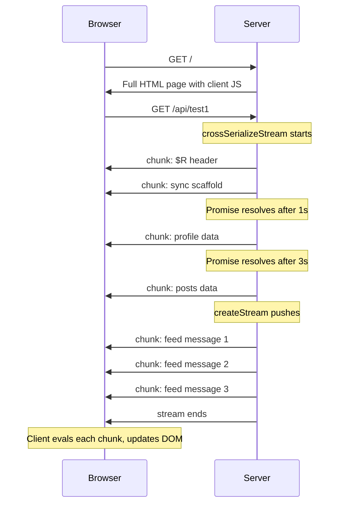

# Seroval Streaming Server/Client Demo

## Approach

Two endpoints in a single [server.ts](server.ts):

- `GET /` -- serves a static HTML page with client-side JS that fetches from `/api/test1` and renders streamed data
- `GET /api/test1` -- uses `crossSerializeStream` to stream serialized JS chunks as an HTTP response (content-type `text/plain` or similar, streamed line-by-line)

Run with `node server.ts`. No extra flags, no build step.

## Data flow

## What `/api/test1` serializes

An object with mixed sync/async data:

- `title` (string) -- available immediately
- `timestamp` (Date) -- available immediately
- `profile` (Promise) -- resolves after 1s with `{ name, bio }`
- `posts` (Promise) -- resolves after 3s with an array of posts
- `feed` (createStream) -- pushes 3 messages at 1s intervals, then closes

## Changes

### 1. Rewrite [index.ts](index.ts) as the server

- Node `http.createServer` on port 3000
- `GET /` -- responds with a complete HTML page containing:
  - Clean UI with sections for each data field and a button to trigger the request
  - Clicking the button fetches `/api/test1` using streaming fetch (`response.body.getReader()`), reads chunks, evals each line, and calls a `render()` function to update the DOM from `$R`
- `GET /api/test1` -- streaming endpoint:
  - Writes `getCrossReferenceHeader()` as the first line
  - Calls `crossSerializeStream(data, { onSerialize(chunk) { res.write(chunk + '\n') } })`
  - Ends the response once all async values and the stream have completed